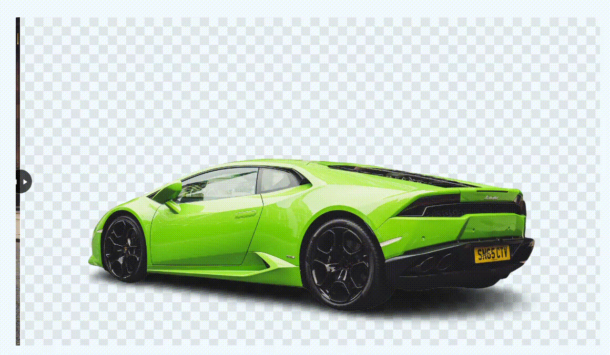

# Image Transition 🌄

## Overview
The *Image Transition* is a web application that provides a visually appealing transition effect between two images. Users can interact with the interface, dragging a slider to reveal or hide parts of the images, creating a dynamic and engaging experience.

## Technologies Used 🚀
- **HTML**
- **CSS**
- **JavaScript**

## Features 🌟
- Interactive image transition effect using a draggable slider.
- Utilizes the [remove.bg](https://www.remove.bg) service for creating transparent backgrounds.
- Smooth transition and arrow indicator for user guidance.

## Usage 💻
1. **Drag Slider:**
   - Hover over the image and use the slider to transition between the original and background-removed images.

2. **Background Options:**
   - The project is configured to use a JPEG background when the slider is on the left side and a PNG background when on the right side.

## Live Demo 🌐
Check out the live demo: [Image Transition Demo](https://image-background-change-effect-red.vercel.app) <!-- Add your live demo link -->

## Installation 🛠️
1. Clone the repository: `git clone https://github.com/your-username/image-transition.git`
2. Open the project folder in your code editor.
3. Launch the `index.html` file in a web browser.

## Customization 🎨
- Replace `images/original.jpg` and `images/background.png` with your desired images.
- Adjust the styling and positioning in `style.css` to fit your design preferences.

## Contributing 🤝
Contributions are welcome! Feel free to enhance the design, add new features, or fix any issues. Open a pull request to contribute.

## License 📜
This project is licensed under the [MIT License](LICENSE.md).

## Author ✨
- Eraycan Sivri
- Contact: eraycansivri@hotmail.com

Enjoy exploring the captivating image transition effect!
